# Solana MEV Bot

This is a sophisticated MEV (Maximum Extractable Value) bot designed to execute arbitrage strategies on the Solana blockchain. It interacts with various DeFi protocols to identify and capitalize on price discrepancies.

## Project Architecture

The project is structured into several modules, each with a specific responsibility.

**Architecture Diagram**



*   **`main.rs`**: The entry point of the application. It handles configuration, initializes the bot, and orchestrates the different arbitrage strategies.
*   **`arbitrage`**: Contains the core logic for finding and executing arbitrage opportunities.
    *   `strategies.rs`: Implements the high-level logic for the different arbitrage strategies.
    *   `simulate.rs`: Handles the simulation of swaps and transactions.
    *   `calc_arb.rs`: Contains the logic for calculating arbitrage opportunities.
*   **`markets`**: Defines structures and logic for different trading markets (liquidity pools) on DEXes like Raydium and Meteora.
*   **`transactions`**: Handles the creation and sending of Solana transactions.
*   **`common`**: Contains shared utilities, constants, and data structures used across the project.
*   **`programs`**: Contains the on-chain Solana programs that the bot interacts with.

## Workflow

The bot follows a multi-stage workflow to discover, monitor, and execute arbitrage opportunities.

**Workflow Diagram**



1.  **Initialization**: The bot starts by loading configuration from `main.rs` and environment variables. This includes setting the simulation amount, defining token pairs for arbitrage, and enabling/disabling strategies.

2.  **Strategy Execution**: The bot can run one or more of the following strategies:
    *   **Massive Strategy (Discovery)**: This strategy is used to discover new arbitrage opportunities.
        *   It loads all available liquidity pools from supported DEXes.
        *   It calculates all possible 1-hop and 2-hop arbitrage paths for the configured token pairs.
        *   Each path is simulated to estimate the potential profit.
        *   Profitable paths are saved to a JSON file and a MongoDB collection for later analysis.
        *   If a highly profitable path is found, it is immediately sent to an external transaction executor via a TCP socket.
    *   **Best Strategy (Monitoring)**: This strategy is designed to monitor a pre-selected list of promising arbitrage paths.
        *   It reads a JSON file containing the best paths found during the discovery phase.
        *   It enters an infinite loop, continuously simulating these paths to check for profitability.
        *   When a path becomes profitable, it is sent to the external executor.
    *   **Optimism Strategy (Execution)**: This strategy is used to execute a single, high-conviction arbitrage opportunity.
        *   It reads a pre-defined transaction from a JSON file.
        *   It then executes this transaction directly on the Solana mainnet.

3.  **Transaction Execution**: For the "Massive" and "Best" strategies, the bot offloads the final transaction execution to an external program. This is done by sending the transaction details over a TCP socket. This allows for more specialized and robust transaction handling. The "Optimism" strategy executes transactions directly.

## Key Features

*   **Multiple Arbitrage Strategies**: Supports discovery, monitoring, and direct execution of arbitrage opportunities.
*   **Multi-DEX Support**: Integrates with Raydium and Meteora to find arbitrage opportunities across different liquidity pools.
*   **External Transaction Executor**: Offloads transaction execution for better performance and reliability.
*   **Data Logging**: Saves arbitrage results to JSON files and a MongoDB database for analysis.
*   **Asynchronous Architecture**: Built with `tokio` for high performance and concurrency.

## Setup and Running

### Prerequisites

*   Rust and Cargo
*   Solana Tool Suite
*   Access to a Solana RPC node

### Configuration

1.  **Environment Variables**: Create a `.env` file to store sensitive information like your private key and RPC URL.
2.  **In-Code Configuration**: Open `src/main.rs` to:
    *   Set the `simulation_amount`.
    *   Configure the `inputs_vec` with the token pairs you want to arbitrage.
    *   Enable or disable strategies (`massive_strategie`, `best_strategie`, `optimism_strategie`).

### Running the Bot

```bash
cargo run --release
```

## Dependencies

The project relies on several key libraries, including:

*   `solana-sdk`, `solana-client`: For interacting with the Solana blockchain.
*   `anchor-client`, `anchor-lang`: For interacting with Anchor-based on-chain programs.
*   `tokio`: For asynchronous runtime.
*   `serde`: For serialization and deserialization of data.
*   `mongodb`: For logging data to a MongoDB database.
*   `raydium_amm`, `lb_clmm`: Local modules for interacting with specific DeFi protocols.

## Contact

You can reach me on Telegram at [Vlad20316](https://t.me/Vlad20316).
